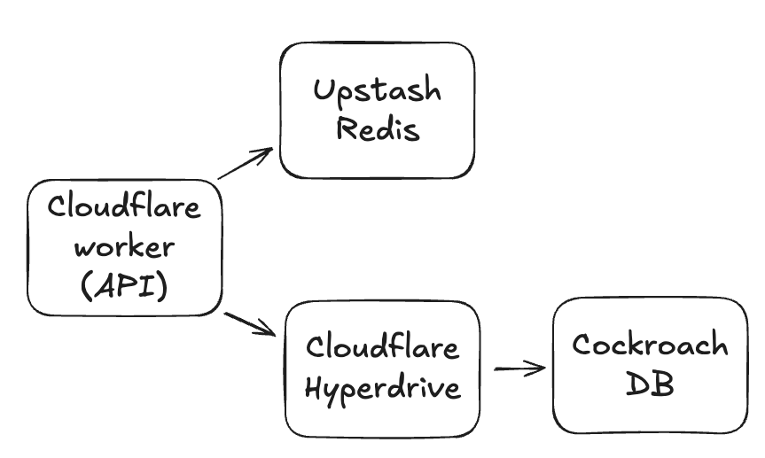
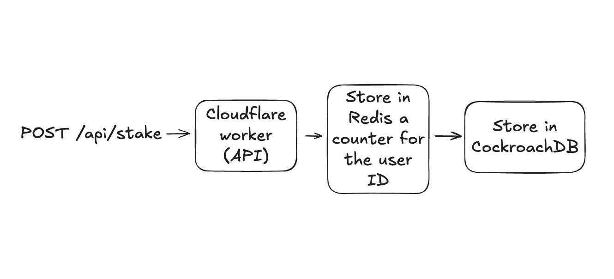

# SERVERLESS STACK PRACTICE

We need to create a serverless environment capable of managing many concurrent requests and as we don't have a DevOps team, we need to use a serverless stack so we just care of writting code.

This application has these requierements:
- Endpoint to authenticate users
```
POST /api/auth
-- Request --
{
  "username": string,
  "password": string
}
-- Response --
{
  "token": <a JWT token with the user ID>
}
```
- You don't need to create a users table, just fake the logic to return always a token for a given user, for example:
```
{
  "id": 1
}
```
- Endpoint to stake tokens with amount and period (number of months, e.g. 1, 3, 6, 12). This action will store the values in a SQL table and a counter in Redis (key the user)
```
POST /api/stake
-- Request --
{
  "amount": number,
  "period": number
}
-- Response --
{
  "success": boolean
}
```
- Endpoint to retrieve my stakes
```
GET /api/stake
-- Response --
{
  "items": [
    {
      "id": string | number, // up to you to define primary key
      "amount": number,
      "period": number
    }
  ]
}
```
(Feel free to add pagination if you want to query something like `/api/stake?page=1&limit=20`. Totally optional)

## Tech Stack
- Cloudflare worker for the API
- Serverless Redis (Upstash)
- Distributed SQL (CockroachDB)

All these SaaS have **free tiers**, so you won't need to pay anything for this project

Here is a diagram of the infrastructure and a use case




